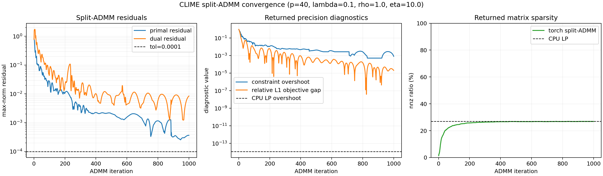

# CLIME PyTorch

This folder contains two CLIME estimators:

- `clime_cpu.py`: exact CPU implementation through one linear program per
  precision-matrix column.
- `clime_torch.py`: GPU-capable PyTorch approximation using split-ADMM. Its
  `X` update is a closed-form linear solve, so there is no nested optimization
  loop inside each ADMM iteration.

CLIME estimates a sparse precision matrix from an empirical covariance matrix
`S` by solving

```text
minimize_Omega  ||Omega||_1
subject to      ||S Omega - I||_max <= lambda.
```

The constraint and objective separate by column. For the `j`-th column
`beta = Omega[:, j]`, the exact problem is

```text
minimize_beta  ||beta||_1
subject to     ||S beta - e_j||_inf <= lambda.
```

## Exact CPU LP

The column problem becomes a linear program after writing `beta = u - v` with
`u, v >= 0`:

```text
minimize_{u,v}  1^T u + 1^T v
subject to      S(u - v) - e_j <= lambda
                e_j - S(u - v) <= lambda
                u, v >= 0.
```

`clime_cpu` solves this exact LP with `scipy.optimize.linprog(method="highs")`.
It is a good correctness baseline, but it runs on CPU and loops over columns.

```python
from clime_pytorch import clime_cpu

theta = clime_cpu(emp_cov, lambda_=0.05)
```

## PyTorch / GPU Approximation

PyTorch does not provide a native GPU linear-programming optimizer. To move the
computation to GPU, `clime_torch` uses a split constrained form:

```text
minimize_X,Y,Z  ||Z||_1 + I_{||Y||_max <= lambda}(Y)
subject to      S X - Y = I
                X - Z = 0.
```

Here `X` is the dense precision variable used by the linear constraint, `Y` is
the box-constrained CLIME residual, and `Z` is the sparse precision variable.
The scaled ADMM updates are

```text
X <- argmin_X rho/2 ||S X - I - Y + U||_F^2
              + eta/2 ||X - Z + V||_F^2
Y <- projection_{[-lambda, lambda]}(S X - I + U)
Z <- soft_threshold(X + V, 1 / eta)
U <- U + S X - I - Y
V <- V + X - Z.
```

The `X` update has a closed-form linear system:

```text
(rho S^T S + eta I) X
  = rho S^T(I + Y - U) + eta(Z - V).
```

`rho S^T S + eta I` is constant, so the implementation factorizes it once
before the ADMM loop and reuses that factor in every iteration. This removes the
previous nested proximal-gradient loop. The method is still not an exact LP
solver: it is an ADMM approximation to the same constrained problem, and early
stopping can leave small constraint or optimality errors. Tune `rho`, `eta`,
and `max_iter`, and compare against `clime_cpu` on small matrices before using
it in a training pipeline.

```python
import torch
from clime_pytorch import clime_torch

emp_cov = emp_cov.cuda()
result = clime_torch(emp_cov, lambda_=0.05, return_info=True)
theta = result.precision
```

`eta` defaults to `10.0` in the current code. It is an ADMM penalty, not a
model regularization parameter, so changing it should not change the target
CLIME solution after convergence. It can change convergence speed and the
quality of early-stopped outputs.

## Symmetrization

The column-wise CLIME solution is not guaranteed to be symmetric. Both
implementations apply the common CLIME symmetrization rule by default:

```text
Omega_sym[i, j] = Omega[i, j] if |Omega[i, j]| <= |Omega[j, i]|
                  else Omega[j, i].
```

Set `symmetrize=False` to inspect the raw directed estimate.

## Can Exact CLIME Run on GPU?

Mathematically yes: each column is a linear program, and linear programs can be
solved by GPU implementations of simplex or interior-point methods. In standard
PyTorch, however, there is no built-in GPU LP solver. A direct GPU port would
need one of:

- a custom CUDA LP solver;
- a GPU-capable optimization package with differentiable or non-differentiable
  LP support;
- an approximate first-order method such as the split-ADMM implementation in
  `clime_torch`.

For this project, the practical path is:

1. Use `clime_cpu` as the exact small-scale baseline.
2. Use `clime_torch` to test whether the ADMM approximation is accurate enough
   and fast enough on GPU.
3. If exact GPU CLIME is required, wrap a real GPU LP solver rather than trying
   to emulate SciPy `linprog` with vanilla PyTorch operations.

## Benchmark

The benchmark mirrors the synthetic sparse precision setup used by
`glasso_pytorch/benchmark_glasso.py`: it samples a sparse diagonally dominant
true precision matrix, draws Gaussian samples, builds an empirical covariance
matrix, and compares the estimated precision matrix against both the true
precision and the exact CPU LP CLIME output.

Run from the repository root:

```bash
python -m clime_pytorch.benchmark_clime --n-samples 200 --n-features 40 --num-problems 3 --repeat 3 --warmup 1 --max-iter 1000 --tol 1e-4 --lambda 0.1 --rho 1.0 --eta 10.0 --dtype float64
```

The benchmark computes constraint diagnostics on the raw column-wise output
before CLIME symmetrization, because `||S Omega - I||_max <= lambda` is the
column-wise LP constraint. Normal API calls still symmetrize by default.

Recorded CPU result from this workspace:

```text
num_problems=3
n_samples=200
n_features=40
lambda=0.1
rho=1.0
eta=10.0
tol=1e-4
max_iter=1000
dtype=float64
device=cpu
linear_solver=auto
```

| method | mean_ms | std_ms | min_ms | n_iter | converged | constraint_max | objective_l1 | offdiag_nnz | rel_fro_to_true | rel_spec_to_true | diff_fro_vs_cpu_lp | diff_spec_vs_cpu_lp |
| --- | ---: | ---: | ---: | ---: | --- | ---: | ---: | ---: | ---: | ---: | ---: | ---: |
| cpu_lp | 109.111 | 0.605 | 108.257 | 0 | True | 0.1 | 35.3733 | 392 | 0.260663 | 0.294294 | 0 | 0 |
| torch_split_admm | 298.637 | 1.053 | 297.745 | 1000 | False | 0.100819 | 35.374 | 390 | 0.260519 | 0.293316 | 0.00690988 | 0.00666245 |

Across three sparse recovery problems:

| method | time_ms_mean | time_ms_std | time_ms_median | time_ms_p95 | time_ms_max |
| --- | ---: | ---: | ---: | ---: | ---: |
| cpu_lp | 109.908 | 0.942589 | 109.261 | 111.043 | 111.24 |
| torch_split_admm | 302.664 | 0.251819 | 302.497 | 302.967 | 303.019 |

| method | constraint_max_mean | constraint_max_std | constraint_max_median | constraint_max_p95 | constraint_max_max |
| --- | ---: | ---: | ---: | ---: | ---: |
| cpu_lp | 0.1 | 7.55003e-15 | 0.1 | 0.1 | 0.1 |
| torch_split_admm | 0.100866 | 0.000214697 | 0.100819 | 0.101116 | 0.101149 |

| method | rel_fro_mean | rel_fro_std | rel_fro_median | rel_fro_p95 | rel_fro_max |
| --- | ---: | ---: | ---: | ---: | ---: |
| cpu_lp | 0.235708 | 0.0202291 | 0.235344 | 0.258131 | 0.260663 |
| torch_split_admm | 0.235682 | 0.0201402 | 0.235337 | 0.258001 | 0.260519 |

| method | rel_spec_mean | rel_spec_std | rel_spec_median | rel_spec_p95 | rel_spec_max |
| --- | ---: | ---: | ---: | ---: | ---: |
| cpu_lp | 0.266257 | 0.0230448 | 0.266629 | 0.291527 | 0.294294 |
| torch_split_admm | 0.265862 | 0.0227741 | 0.266719 | 0.290657 | 0.293316 |

Interpretation: on this CPU run, SciPy HiGHS is faster at `p=40` because it is
an exact optimized LP solver and PyTorch is not using GPU here. The split-ADMM
output is very close to the CPU LP baseline in recovery metrics and has only a
small constraint overshoot after 1000 iterations. The intended benefit of
`clime_torch` is batched/GPU experimentation, not replacing CPU HiGHS for small
single-matrix exact solves.

### Split-ADMM Convergence

The convergence diagnostic below uses the same first synthetic problem as the
benchmark table:

```bash
python -m clime_pytorch.plot_clime_convergence --n-samples 200 --n-features 40 --max-iter 1000 --tol 1e-4 --lambda 0.1 --rho 1.0 --eta 10.0 --dtype float64
```



The plot shows the current split-ADMM behavior clearly: the first few hundred
iterations reduce the residuals quickly, then the tail becomes slower and
oscillatory. This is expected for an ADMM first-order method with fixed
penalties; in convex problems ADMM is usually judged by residual and objective
diagnostics rather than a clean monotone linear rate.

Recorded output:

```text
n_iter=1000
converged=False
final_primal=3.62939e-4
final_dual=8.42642e-3
final_constraint=0.100819
final_constraint_overshoot=8.19453e-4
final_rel_objective_gap=2.08689e-5
final_nnz_ratio=26.88%
cpu_nnz_ratio=27.00%
cpu_constraint=0.1
```

So under the current default diagnostic setting, the strict ADMM stopping rule
does not pass because the dual residual is still above `tol=1e-4`. However, the
returned raw precision matrix is already close to the exact CPU LP solution:
its CLIME constraint exceeds `lambda=0.1` by about `8.2e-4`, and its L1
objective differs from the CPU LP objective by about `2.1e-5` relatively. The
right panel reports the raw returned matrix sparsity using
`abs(entry) > 1e-8` over all entries; the split-ADMM result reaches `26.88%`,
close to the CPU LP baseline `27.00%`. For using CLIME inside a training loop,
this suggests monitoring the returned constraint overshoot, objective gap, and
nnz ratio in addition to the internal ADMM primal and dual residuals.

This also shows the main limitation of using ADMM here. CLIME is an LP with a
nonsmooth L1 objective and box constraints, while this PyTorch implementation is
a first-order split-ADMM approximation with fixed penalties. It can approach
the exact LP solution, but the high-accuracy tail is slow and may require many
iterations. Therefore, `clime_torch` should not be treated as a replacement for
an exact LP optimizer such as SciPy HiGHS when an exact standalone CLIME solve is
needed. Its practical role is GPU-compatible approximate inference, early-stop
experiments, or use as a differentiable/non-differentiable algorithmic layer in
a training pipeline where small CLIME constraint errors are acceptable.
