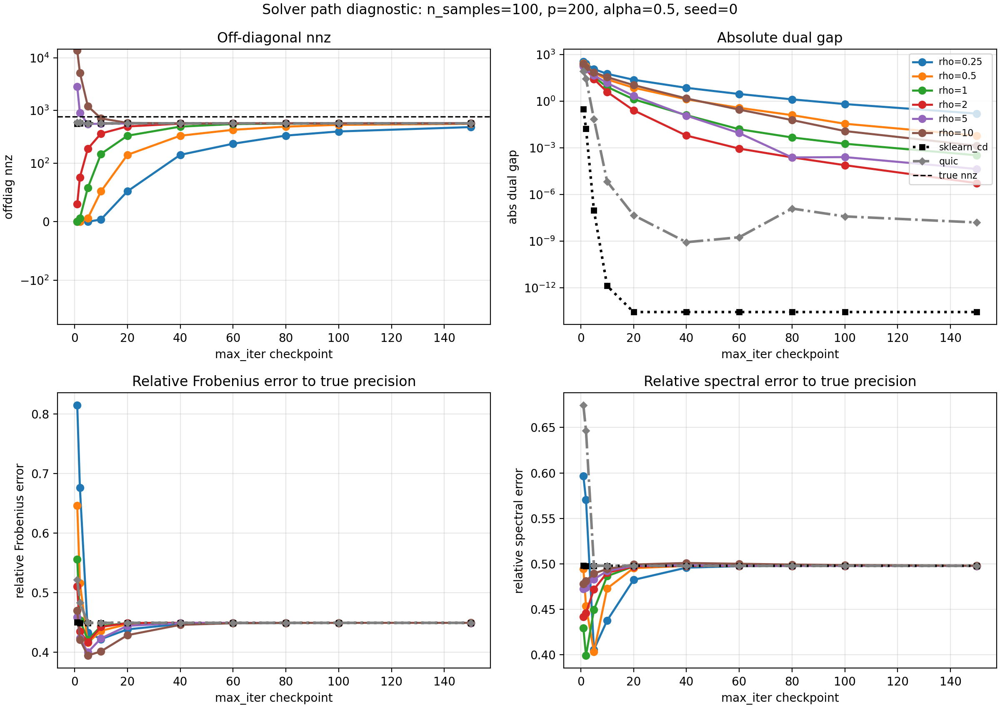

# PyTorch Graphical Lasso

`glasso_pytorch` provides a dense, native PyTorch implementation of graphical
lasso. The input to the core solver is an empirical covariance matrix `S`, and
the output is a sparse precision matrix `Theta`.

```python
import torch
from glasso_pytorch import GraphicalLassoModule, graphical_lasso, GraphicalLasso

x = torch.randn(512, 64)
x = x - x.mean(dim=0, keepdim=True)
emp_cov = x.T @ x / (x.shape[0] - 1)

precision = graphical_lasso(emp_cov, alpha=0.05, max_iter=100)

model = GraphicalLasso(alpha=0.05, max_iter=100).fit(emp_cov)
precision = model.precision_

layer = GraphicalLassoModule(alpha=0.05, max_iter=100, allow_backward=False)
cov_batch = torch.stack([emp_cov, emp_cov + 0.01 * torch.eye(emp_cov.shape[0])])
precision_batch = layer(cov_batch)  # shape: (2, 64, 64)

sample_layer = GraphicalLassoModule(alpha=0.05, input_mode="samples")
raw_samples = torch.randn(32, 64)
sample_precision_batch = sample_layer(raw_samples)  # shape: (32, 64, 64)
```

The implementation solves the standard graphical lasso objective:

```text
minimize_Theta  trace(S Theta) - logdet(Theta) + alpha * ||Theta||_1
subject to      Theta positive definite
```

By default, only off-diagonal entries are L1-penalized. This matches the common
convention used by scikit-learn and treats diagonal precision entries as
unpenalized variance terms. Set `penalize_diagonal=True` to apply soft
thresholding to every entry.

## ADMM Logic

The PyTorch solver uses ADMM with dense matrices. It introduces an auxiliary
matrix `Z` and scaled dual variable `U`:

```text
Theta update:
  minimize trace(S Theta) - logdet(Theta)
           + rho / 2 * ||Theta - Z + U||_F^2

Z update:
  soft_threshold(Theta + U, alpha / rho)

U update:
  U <- U + Theta - Z
```

The `Theta` step has a closed-form eigendecomposition. If

```text
Q diag(d) Q^T = rho * (Z - U) - S
```

then the updated precision eigenvalues are

```text
(d + sqrt(d^2 + 4 rho)) / (2 rho)
```

This keeps `Theta` positive definite at every iteration. The `Z` update applies
soft thresholding to produce sparsity, and the loop stops when both the primal
residual `||Theta - Z||_F` and dual residual `rho * ||Z - Z_old||_F` meet the
configured tolerances.

The function supports covariance batches with shape `(..., p, p)` and preserves
the input tensor dtype and device, so CUDA tensors run on GPU.

`GraphicalLassoModule` is a parameter-free `torch.nn.Module` wrapper around the
same solver. By default it accepts covariance matrices:

- `(batch, n_features, n_features)` returns `(batch, n_features, n_features)`

Set `input_mode="samples"` if the module should build covariance matrices from
raw samples first. In that mode, `(batch, n_features)` and
`(batch, n_samples, n_features)` both return `(batch, n_features, n_features)`.
Raw samples are not centered by default; pass `center=True` if the module should
subtract the sample mean before forming covariance. Set `allow_backward=False` to
run it as a GPU-capable algorithmic layer without retaining gradients through the
ADMM iterations. Set `allow_backward=True` when the precision output should
remain connected to the raw sample or covariance input.

## Benchmark

The current evaluation focuses on four questions:

- ADMM convergence speed under different `rho`.
- CPU runtime needed to reach `tol=1e-4`.
- Truncated-iteration recovery behavior, measured by `offdiag_nnz`,
  `rel_fro_to_true`, and `rel_spec_to_true`.
- GPU memory and runtime cost when the glasso block is inserted into a deep
  learning computation graph.

The available solvers are:

- `sklearn_cd`: `sklearn.covariance.graphical_lasso`
- `quic`: `inverse_covariance.quic`
- `torch_admm`: `glasso_pytorch.graphical_lasso`

Run from the repository root:

```bash
python -m glasso_pytorch.benchmark_glasso --n-samples 100 --n-features 200 --alpha 0.5 --max-iter 100 --tol 1e-4
```

### Experimental Setup

The sparse recovery experiments sample sparse true precision matrices with the
same sparsity rate:

```text
M_ij ~ Bernoulli(edge_prob), for i < j
W_ij ~ Uniform(edge_weight_min, edge_weight_max)
sign_ij ~ Uniform({-1, 1})
Theta_ij = M_ij * sign_ij * W_ij, for i < j
Theta_ji = Theta_ij
Theta_ii = sum_{j != i} |Theta_ij| + diagonal_shift
```

The diagonal construction makes `Theta_true` strictly diagonally dominant with
positive diagonal entries, so it is symmetric positive definite. With
`edge_prob=0.02` and `p=200`, the expected number of undirected nonzero edges is

```text
edge_prob * p * (p - 1) / 2 = 398
```

The population covariance is

```text
Sigma_true = inverse(Theta_true)
```

Then the script draws `n_samples=100` observations:

```text
x_l ~ N(0, Sigma_true), l = 1, ..., n_samples
```

and computes the empirical covariance:

```text
S = (X - mean(X))^T (X - mean(X)) / (n_samples - 1)
```

Recovery quality is measured against `Theta_true`:

```text
rel_fro_to_true  = ||Theta_hat - Theta_true||_F / ||Theta_true||_F
rel_spec_to_true = ||Theta_hat - Theta_true||_2 / ||Theta_true||_2
```

The reported dual gap uses the scikit-learn convention:

```text
trace(S Theta) - p + alpha * ||Theta_offdiag||_1
```

### ADMM Fixed-Iteration Sparsity Observation

Question:

Does ADMM naturally obtain a much sparser solution first and then recover more
nonzero entries later, or is the observed sparsity in the fixed-iteration
experiment mainly caused by an imbalanced experimental setting?

Answer:

The observed behavior is mainly a fixed-iteration / parameter-setting effect.
It is not a solver-intrinsic guarantee that ADMM always recovers precision
matrices by first producing an overly sparse solution and then restoring nonzero
entries.

The ADMM splitting used here returns the sparse auxiliary variable `Z`, whose
update is a soft-thresholding step:

```text
Z^{k+1} = soft_threshold(Theta^{k+1} + U^k, alpha / rho)
```

Before convergence, entries below `alpha / rho` can be set exactly to zero in
`Z`. When `Theta` and `Z` have not yet matched, an early-stopped run can look
much sparser than the eventual converged solution. In the diagnostic setting:

```text
alpha = 0.5
rho = 1.0
fixed_iter = 20
threshold = alpha / rho = 0.5
```

the `fixed_iter=20` ADMM point on the first sparse recovery problem has:

```text
torch_admm abs_dual_gap = 1.35898
torch_admm offdiag_nnz  = 332
```

This point is still far from convergence, so its smaller `offdiag_nnz` should
be interpreted as an early-stopping path effect, not as evidence that the
converged ADMM solution is intrinsically sparser.

Experimental result:

The diagnostic script below fixes the first simulated sparse recovery problem
and sweeps ADMM `rho` over `0.25, 0.5, 1.0, 2.0, 5.0, 10.0`. It also overlays
sklearn coordinate descent and QUIC trajectories by repeatedly solving the same
problem with the same `max_iter` checkpoints. The sklearn / QUIC curves are
therefore checkpoint curves under an iteration budget, not direct logs of their
internal per-iteration states. The true precision matrix has `772`
off-diagonal nonzero entries under the `abs(x) > 1e-8` counting rule.

```bash
python -m glasso_pytorch.plot_admm_rho_path
```



The plot shows that the fixed-iteration sparsity path is strongly affected by
`rho`. It now records four path diagnostics: off-diagonal nnz, absolute dual
gap, relative Frobenius error to `Theta_true`, and relative spectral error to
`Theta_true`. With `rho=1.0`, ADMM starts overly sparse and approaches about
`570` off-diagonal nonzeros, matching the converged sklearn / QUIC solution on
this problem. With larger `rho`, the threshold `alpha / rho` is smaller, and
early iterates can be much denser instead of sparser. Therefore,
fixed-iteration nnz is useful as an early-path diagnostic only. For fair
final-solution comparison, compare nnz and recovery error after solvers reach
the same convergence tolerance or the same target dual gap.

The same script also reports CPU time needed to reach solver `tol=1e-4` on this
single diagnostic problem. For ADMM, `tol` is the primal / dual residual
stopping tolerance; `abs_dual_gap` is reported as an additional diagnostic.

| method | rho | n_iter | time_ms | abs_dual_gap | offdiag_nnz | converged |
| --- | ---: | ---: | ---: | ---: | ---: | --- |
| sklearn_cd | - | 3 | 273.951 | 1.90585e-05 | 570 | reported |
| quic | - | 10 | 31.899 | 1.74832e-05 | 570 | reported |
| torch_admm | 0.25 | 237 | 1443.511 | 0.0166356 | 552 | True |
| torch_admm | 0.5 | 119 | 813.500 | 0.0165418 | 552 | True |
| torch_admm | 1.0 | 60 | 416.232 | 0.0160263 | 552 | True |
| torch_admm | 2.0 | 30 | 246.297 | 0.0289314 | 554 | True |
| torch_admm | 5.0 | 37 | 309.373 | 0.178603 | 570 | True |
| torch_admm | 10.0 | 69 | 513.229 | 0.14487 | 570 | True |

## CUDA Module Demo

`demo_glasso_module_cuda.py` measures the parameter-free `GraphicalLassoModule`
on batched covariance inputs. The default setting runs 10 synthetic batches on
`cuda:1`, with each batch containing 16 covariance matrices of shape
`(200, 200)`.

Run from the repository root:

```bash
python -m glasso_pytorch.demo_glasso_module_cuda --device cuda:1 --batch-size 16 --n-features 200 --num-batches 10
```

The script reports average runtime, average dual gap, and CUDA memory for two modes:

- `forward_only`: `allow_backward=False`
- `forward_backward`: `allow_backward=True`, followed by `loss.backward()`

Synthetic covariance generation is excluded from the reported timing, so the
numbers focus on the glasso block itself.

## Recorded CUDA Result

This result was measured on `cuda:1` with:

```text
batch_size=16
n_features=200
num_batches=10
dtype=float32
alpha=0.05
max_iter=20
tol=1e-4
rtol=1e-4
```

| mode | avg_time_ms | avg_dual_gap | avg_baseline_allocated_mb | avg_peak_allocated_mb | avg_peak_delta_allocated_mb | avg_peak_reserved_mb |
| --- | ---: | ---: | ---: | ---: | ---: | ---: |
| forward_only | 1277.913 | 14.229 | 10.566 | 45.472 | 34.905 | 62.000 |
| forward_backward | 1331.193 | 14.1327 | 17.879 | 358.335 | 340.457 | 382.000 |

`avg_peak_delta_allocated_mb` is the additional peak allocated memory above the
already allocated input covariance batch.
