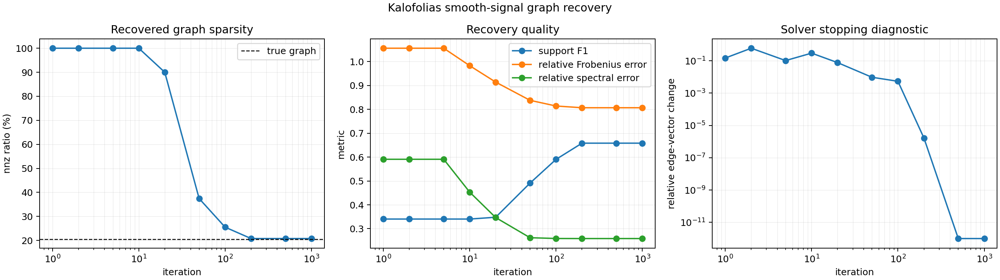
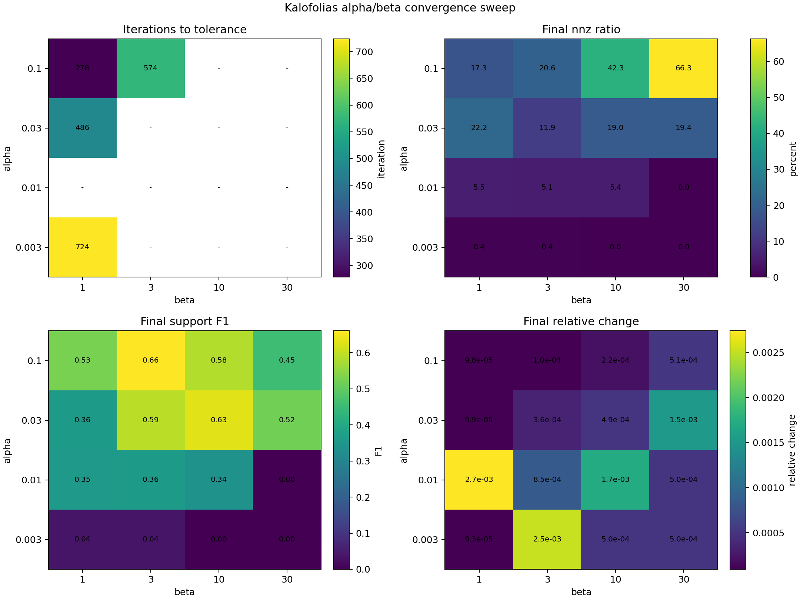
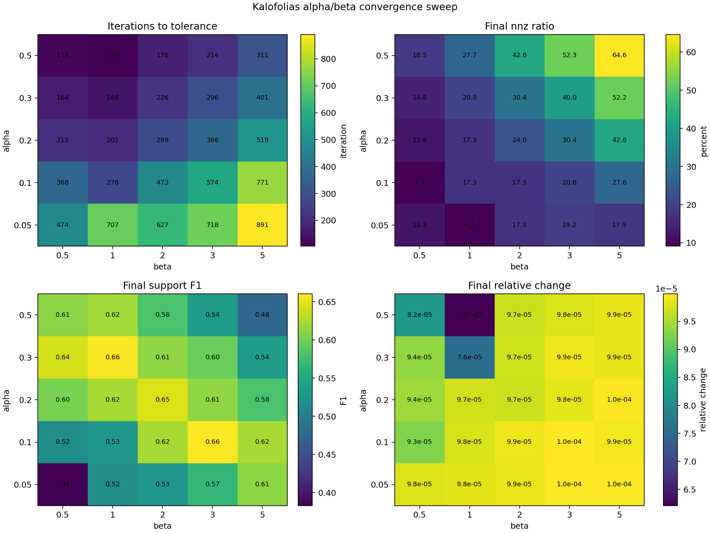
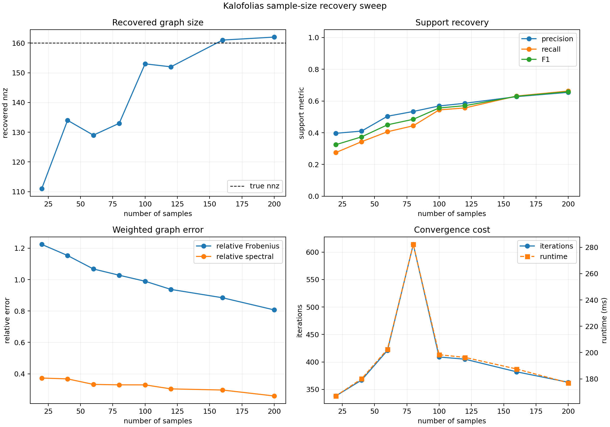

# Kalofolias Smooth-Signal Graph Learning

This folder implements the graph-learning model from:

```text
Vassilis Kalofolias, "How to Learn a Graph from Smooth Signals",
AISTATS 2016.
```

Paper: https://proceedings.mlr.press/v51/kalofolias16.html

## Model

The input is a smooth signal matrix:

```text
X: (n_nodes, n_signals)
```

Each row is one node, and each column is one observed signal over the graph.
The solver first computes pairwise squared distances between node signal rows:

```text
Z_ij = ||X_i - X_j||_2^2.
```

Then it estimates a nonnegative undirected adjacency matrix by solving the
Kalofolias vectorized objective:

```text
min_w  2 z^T w - alpha * sum_i log((S w)_i) + beta * ||w||_2^2
s.t.   w >= 0.
```

Here `w` contains upper-triangular edge weights, `S w` is the node degree
vector, `alpha` controls the log-degree barrier, and `beta` controls L2
shrinkage. The returned graph is the symmetric adjacency matrix:

```text
W: (n_nodes, n_nodes)
```

## Usage

```python
from kalofolias_graph_learning import learn_graph_from_smooth_signals

W = learn_graph_from_smooth_signals(X, alpha=0.3, beta=1.0, max_iter=1000)
```

Use `return_info=True` to get edge weights, degree vector, objective history,
relative-change history, and nnz-ratio history.

The package also provides a PyTorch `nn.Module` wrapper. It is algorithmic and
does not backpropagate through the solver by default:

```python
from kalofolias_graph_learning import KalofoliasGraphLearningModule

module = KalofoliasGraphLearningModule(
    alpha=0.3,
    beta=1.0,
    max_iter=200,
    tol=1e-4,
    output_mode="laplacian",
)

theta = module(node_signals)  # (N, N), or (B, N, N) for batched input
```

`output_mode="adjacency"` returns the learned nonnegative graph weights.
`output_mode="laplacian"` returns `diag(W 1) - W`, which is the default used by
the unrolled model when `model.glasso_method: kalofolias`.

## Recovery Benchmark

The benchmark uses the same synthetic scale as the GLASSO and CLIME tests
(`n_samples=200`, `n_features=40`), but the graph source is different because
Kalofolias learns a nonnegative adjacency matrix rather than a signed precision
matrix. The benchmark first samples a symmetric nonnegative graph weight matrix
with exactly `true_nnz` undirected edges:

```text
W_true: (n_features, n_features), W_true >= 0, W_true = W_true^T.
```

It then forms a Laplacian-based Gaussian precision:

```text
L = diag(W_true 1) - W_true
Theta = L + diagonal_shift * I.
```

The diagonal shift is needed because a pure graph Laplacian is singular. Samples
are drawn from `N(0, Theta^{-1})` and then transposed into node-signal form:

```text
samples: (n_samples, n_features)
X = samples.T: (n_features, n_samples)
```

The true graph support is defined directly from the nonnegative graph weights:

```text
true edge (i, j) exists iff W_true[i, j] > 0.
```

### Local Candidate-Set Variant

A local sparse version is implemented in `local_kalofolias/`. It restricts the
candidate graph to a fixed neighbor list and returns local weights with shape:

```text
local_weights: (40, 10)
```

The corresponding benchmark uses 400 candidate slots and activates only 4 slots
per node in the true graph, so local sparsity is measured on `40 * 10` slots
instead of all dense graph pairs. In the recorded default run, the true local
nnz is `160/400`, and the solver converges to `104/400` nonzero slots with
support precision `1.0` and recall `0.65`.

Run:

```bash
python -m local_kalofolias.benchmark_local_kalofolias --n-samples 200 --n-nodes 40 --k-neighbors 10 --active-neighbors-per-node 4 --max-iter 1000 --alpha 0.3 --beta 1.0 --threshold 1e-4 --dtype float64
```

Run from the repository root:

```bash
python -m kalofolias_graph_learning.benchmark_kalofolias --n-samples 200 --n-features 40 --true-nnz 160 --max-iter 1000 --alpha 0.3 --beta 1.0 --threshold 1e-4 --dtype float64
```

Recorded result from this workspace:

```text
n_samples=200
n_features=40
requested_true_nnz=160
true_nnz=160
alpha=0.3
beta=1.0
threshold=1e-4
max_iter=1000
dtype=float64
```

| iter | nnz | nnz_ratio | precision | recall | f1 | rel_fro | rel_spec | rel_change |
| ---: | ---: | ---: | ---: | ---: | ---: | ---: | ---: | ---: |
| 1 | 780 | 1.0000 | 0.2051 | 1.0000 | 0.3404 | 1.05622 | 0.590897 | 0.149272 |
| 2 | 780 | 1.0000 | 0.2051 | 1.0000 | 0.3404 | 1.05622 | 0.590897 | 0.603666 |
| 5 | 780 | 1.0000 | 0.2051 | 1.0000 | 0.3404 | 1.05622 | 0.590897 | 0.103919 |
| 10 | 780 | 1.0000 | 0.2051 | 1.0000 | 0.3404 | 0.98301 | 0.453208 | 0.299425 |
| 20 | 702 | 0.9000 | 0.2137 | 0.9375 | 0.3480 | 0.91425 | 0.34669 | 0.0775293 |
| 50 | 292 | 0.3744 | 0.3801 | 0.6937 | 0.4912 | 0.837888 | 0.262254 | 0.00962668 |
| 100 | 199 | 0.2551 | 0.5327 | 0.6625 | 0.5905 | 0.814103 | 0.258998 | 0.00541317 |
| 200 | 162 | 0.2077 | 0.6543 | 0.6625 | 0.6584 | 0.806879 | 0.258706 | 1.67054e-06 |
| 500 | 162 | 0.2077 | 0.6543 | 0.6625 | 0.6584 | 0.806878 | 0.258706 | 9.92997e-13 |
| 1000 | 162 | 0.2077 | 0.6543 | 0.6625 | 0.6584 | 0.806878 | 0.258706 | 9.92997e-13 |



In this synthetic setting, the graph starts dense and becomes sparse during the
iteration path. With `alpha=0.3, beta=1.0`, the learned graph reaches 162 edges
by 200 iterations and remains stable through 1000 iterations, close to the 160
true undirected edges. Support F1 stabilizes around `0.658`.

## Alpha/Beta Convergence Sweep

The sweep below uses the same synthetic problem and compares convergence speed
against graph recovery quality:

```bash
python -m kalofolias_graph_learning.sweep_alpha_beta --alphas 0.003,0.01,0.03,0.1 --betas 1,3,10,30 --n-samples 200 --n-features 40 --true-nnz 160 --max-iter 1000 --tol 1e-4 --threshold 1e-4 --dtype float64
```



Recorded output:

| alpha | beta | iter_to_tol | final_rel_change | nnz | nnz_ratio | precision | recall | f1 | rel_fro | rel_spec |
| ---: | ---: | ---: | ---: | ---: | ---: | ---: | ---: | ---: | ---: | ---: |
| 0.003 | 1 | 724 | 9.29547e-5 | 3 | 0.0038 | 1.0000 | 0.0187 | 0.0368 | 1.27119 | 0.461508 |
| 0.003 | 3 | - | 2.5197e-3 | 3 | 0.0038 | 1.0000 | 0.0187 | 0.0368 | 1.27432 | 0.483627 |
| 0.003 | 10 | - | 4.9791e-4 | 0 | 0.0000 | 0.0000 | 0.0000 | 0.0000 | 1.05622 | 0.590897 |
| 0.003 | 30 | - | 5.00037e-4 | 0 | 0.0000 | 0.0000 | 0.0000 | 0.0000 | 1.05622 | 0.590897 |
| 0.01 | 1 | - | 2.74052e-3 | 43 | 0.0551 | 0.8372 | 0.2250 | 0.3547 | 1.08099 | 0.319658 |
| 0.01 | 3 | - | 8.4751e-4 | 40 | 0.0513 | 0.9000 | 0.2250 | 0.3600 | 1.06601 | 0.337063 |
| 0.01 | 10 | - | 1.71858e-3 | 42 | 0.0538 | 0.8095 | 0.2125 | 0.3366 | 1.05863 | 0.324916 |
| 0.01 | 30 | - | 5.01428e-4 | 0 | 0.0000 | 0.0000 | 0.0000 | 0.0000 | 1.05622 | 0.590897 |
| 0.03 | 1 | 486 | 9.94633e-5 | 173 | 0.2218 | 0.3468 | 0.3750 | 0.3604 | 1.04012 | 0.319513 |
| 0.03 | 3 | - | 3.58858e-4 | 93 | 0.1192 | 0.8065 | 0.4688 | 0.5929 | 0.954391 | 0.31148 |
| 0.03 | 10 | - | 4.89734e-4 | 148 | 0.1897 | 0.6554 | 0.6062 | 0.6299 | 0.838727 | 0.263321 |
| 0.03 | 30 | - | 1.52969e-3 | 151 | 0.1936 | 0.5364 | 0.5062 | 0.5209 | 0.913649 | 0.423932 |
| 0.1 | 1 | 278 | 9.75622e-5 | 135 | 0.1731 | 0.5778 | 0.4875 | 0.5288 | 0.942244 | 0.308982 |
| 0.1 | 3 | 574 | 9.98706e-5 | 161 | 0.2064 | 0.6584 | 0.6625 | 0.6604 | 0.806996 | 0.258728 |
| 0.1 | 10 | - | 2.15726e-4 | 330 | 0.4231 | 0.4333 | 0.8938 | 0.5837 | 0.729637 | 0.214541 |
| 0.1 | 30 | - | 5.07824e-4 | 517 | 0.6628 | 0.2979 | 0.9625 | 0.4549 | 0.775187 | 0.316921 |

Summary:

- Fastest relative-change convergence: `alpha=0.1, beta=1`, reaching
  `tol=1e-4` at 278 iterations, but it underestimates the graph (`nnz=135`) and
  has lower support F1 (`0.5288`).
- Best support recovery in this sweep: `alpha=0.1, beta=3`, with `nnz=161`
  against 160 true edges and F1 `0.6604`; it reaches `tol=1e-4` at 574
  iterations.
- Very small `alpha` over-sparsifies the recovered graph in this Laplacian
  benchmark, often returning only a few edges or none under the fixed threshold.
- Larger `beta` can either improve support balance or make the graph too dense,
  depending on `alpha`. In this denser graph setting, convergence speed alone is
  still not enough; monitor `nnz`, support F1, and relative errors together.

### Focused Fast-Convergence Sweep

After the broad sweep, a focused sweep over larger `alpha` and smaller/mid
`beta` found a faster setting with nearly the same recovery quality:

```bash
python -m kalofolias_graph_learning.sweep_alpha_beta --alphas 0.05,0.1,0.2,0.3,0.5 --betas 0.5,1,2,3,5 --n-samples 200 --n-features 40 --true-nnz 160 --max-iter 1000 --tol 1e-4 --threshold 1e-4 --dtype float64 --output kalofolias_graph_learning/figures/alpha_beta_sweep_focused.png
```



Key rows:

| alpha | beta | iter_to_tol | nnz | precision | recall | f1 | rel_fro | rel_spec |
| ---: | ---: | ---: | ---: | ---: | ---: | ---: | ---: | ---: |
| 0.1 | 3 | 574 | 161 | 0.6584 | 0.6625 | 0.6604 | 0.806996 | 0.258728 |
| 0.3 | 1 | 148 | 162 | 0.6543 | 0.6625 | 0.6584 | 0.806834 | 0.258699 |
| 0.5 | 1 | 104 | 216 | 0.5417 | 0.7312 | 0.6223 | 0.761293 | 0.240415 |

Therefore, the convergence iteration count can be reduced substantially. The
current best tradeoff is `alpha=0.3, beta=1`: it reaches the same support
quality as `alpha=0.1, beta=3` in about one quarter of the iterations. Pushing
`alpha` higher can reduce iterations further, but the recovered graph becomes
too dense and support precision drops.

## Sample-Size Sweep

Using the faster tradeoff `alpha=0.3, beta=1`, the following experiment varies
the number of smooth graph signals from 20 to 200 while keeping the true graph
fixed at 160 undirected edges:

```bash
python -m kalofolias_graph_learning.sweep_sample_size --sample-sizes 20,40,60,80,100,120,160,200 --n-features 40 --true-nnz 160 --alpha 0.3 --beta 1.0 --max-iter 1000 --tol 1e-12 --threshold 1e-4 --dtype float64
```



Recorded output:

| n_samples | nnz | nnz_ratio | precision | recall | f1 | rel_fro | rel_spec | n_iter | time_ms | converged | rel_change |
| ---: | ---: | ---: | ---: | ---: | ---: | ---: | ---: | ---: | ---: | --- | ---: |
| 20 | 111 | 0.1423 | 0.3964 | 0.2750 | 0.3247 | 1.2241 | 0.372994 | 338 | 167.003 | True | 8.91738e-13 |
| 40 | 134 | 0.1718 | 0.4104 | 0.3438 | 0.3741 | 1.15326 | 0.367526 | 367 | 180.062 | True | 9.92058e-13 |
| 60 | 129 | 0.1654 | 0.5039 | 0.4062 | 0.4498 | 1.06757 | 0.33245 | 421 | 202.515 | True | 9.66589e-13 |
| 80 | 133 | 0.1705 | 0.5338 | 0.4437 | 0.4846 | 1.02769 | 0.329702 | 614 | 282.201 | True | 9.98236e-13 |
| 100 | 153 | 0.1962 | 0.5686 | 0.5437 | 0.5559 | 0.989542 | 0.3295 | 409 | 198.375 | True | 8.69987e-13 |
| 120 | 152 | 0.1949 | 0.5855 | 0.5563 | 0.5705 | 0.937461 | 0.303927 | 405 | 196.320 | True | 9.93294e-13 |
| 160 | 161 | 0.2064 | 0.6273 | 0.6312 | 0.6293 | 0.884245 | 0.296685 | 382 | 187.518 | True | 9.60691e-13 |
| 200 | 162 | 0.2077 | 0.6543 | 0.6625 | 0.6584 | 0.806878 | 0.258706 | 363 | 176.985 | True | 9.92997e-13 |

As expected, graph recovery improves as more smooth signals are observed. The
learned nnz approaches the true 160 edges once the sample count reaches about
160, and support F1 rises from `0.3247` at 20 samples to `0.6584` at 200
samples. Weighted graph errors also decrease steadily with sample size. The
iterations-to-convergence panel reports the actual number of primal-dual
iterations and wall-clock runtime needed to reach `tol=1e-12`. Runtime is
measured around the full `learn_graph_from_smooth_signals` call, including
pairwise distance computation and primal-dual iterations. Because `n_features`
is fixed at 40, runtime mostly tracks iteration count rather than increasing
monotonically with sample size. The 80-sample case takes the most iterations in
this run, while the recovery quality still improves as sample count increases.
