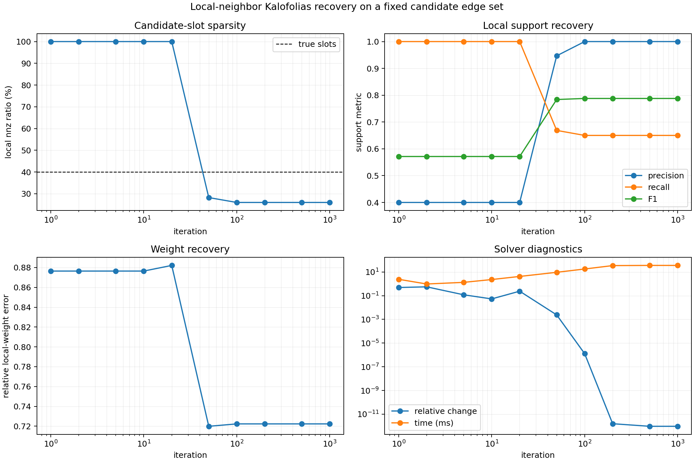

# Local Kalofolias Graph Learning

This folder contains a PyTorch implementation of the Kalofolias smooth-signal
graph learning objective restricted to a fixed local candidate edge set.

## Local Representation

The default graph is represented by a neighbor list and a local weight matrix:

```text
neighbor_list:  (N, K)
local_weights:  (N, K)
```

`local_weights[i, k]` is the learned edge weight from node `i` to
`neighbor_list[i, k]`. For the benchmark setting:

```text
N = 40
K = 10
candidate slots = N * K = 400
```

The default neighbor list is ring-local. Each node can connect only to the 10
nearby node ids:

```text
i-5, i-4, i-3, i-2, i-1, i+1, i+2, i+3, i+4, i+5    mod N
```

The true graph activates only 4 of those 10 candidate slots per node:

```text
i-2, i-1, i+1, i+2    mod N
```

So the local true sparsity is:

```text
true local nnz = 40 * 4 = 160
true local nnz ratio = 160 / 400 = 40%
```

When this local graph is converted to a symmetric dense graph, the 160 directed
candidate slots correspond to 80 undirected edges.

## Solver

The solver keeps the Kalofolias objective, but the variables are the local
candidate edge weights instead of all upper-triangular edges:

```text
min_W  2 <Z, W> - alpha * sum_i log(d_i) + beta * ||W||_F^2
s.t.   W >= 0
```

where:

```text
W: (N, K)
Z[i, k] = ||X_i - X_neighbor(i,k)||_2^2
d_i = sum_k W[i, k]
```

This is a row-local sparse representation. The helper
`local_weights_to_dense(..., symmetric=True)` scatters the local matrix into a
dense adjacency and averages paired directed slots.

The module wrapper disables autograd through the iterative solver by default:

```python
import torch
from local_kalofolias import LocalKalofoliasGraphLearning, build_ring_neighbor_list

neighbor_list = build_ring_neighbor_list(n_nodes=40, k=10)
module = LocalKalofoliasGraphLearning(neighbor_list, max_iter=200)

signals = torch.randn(40, 200)
local_weights = module(signals)  # (40, 10)
```

In `clean_lib.unrolling_model.UnrollingModel`, set
`model.theta.method: kalofolias` and `model.theta.kalofolias.graph: local` to
use this solver for Theta. The main graph-learning neighbor count remains
`model.graph.kNN`; local Theta uses the separate `model.theta.local_kNN`
candidate list and passes both `Theta: (N, local_kNN)` and
`theta_neighbor_list: (N, local_kNN)` into `ADMMBlock`. ADMM then applies the
local operator directly, without materializing a dense `(N, N)` Theta matrix.
The default convention is `model.theta.local_kNN = model.graph.kNN + 4`.

Training logs compare learned local Theta support against the original
`model.kNN` graph. The recorded sparsity diagnostic is not a global nnz ratio;
it is the average per-node support change:

```text
added/node   = learned Theta edges outside the original kNN list
removed/node = original kNN edges missing from learned Theta
```

## Benchmark

Run from the repository root:

```bash
python -m local_kalofolias.benchmark_local_kalofolias --n-samples 200 --n-nodes 40 --k-neighbors 10 --active-neighbors-per-node 4 --max-iter 1000 --alpha 0.3 --beta 1.0 --threshold 1e-4 --dtype float64
```

The benchmark:

1. Builds the ring-local `neighbor_list` with shape `(40, 10)`.
2. Generates a symmetric nonnegative true graph using only the closest 4 local
   candidate slots per node.
3. Samples smooth signals from `N(0, (L + diagonal_shift I)^-1)`.
4. Learns a local `(40, 10)` graph.
5. Computes nnz, support precision, recall, F1, and weight error over the 400
   candidate slots, not over the full dense `40 x 40` matrix.

Recorded result from this workspace:

```text
n_samples=200
n_nodes=40
K=10
candidate_slots=400
active_slots_per_node=4
true_local_nnz=160
true_local_nnz_ratio=0.4000
true_undirected_edges=80
learned_undirected_edges=59
alpha=0.3
beta=1.0
threshold=1e-4
max_iter=1000
dtype=float64
```

| iter | time_ms | nnz | nnz_ratio | precision | recall | f1 | rel_fro | rel_change |
| ---: | ---: | ---: | ---: | ---: | ---: | ---: | ---: | ---: |
| 1 | 2.415 | 400 | 1.0000 | 0.4000 | 1.0000 | 0.5714 | 0.876449 | 0.490771 |
| 2 | 0.970 | 400 | 1.0000 | 0.4000 | 1.0000 | 0.5714 | 0.876449 | 0.558765 |
| 5 | 1.333 | 400 | 1.0000 | 0.4000 | 1.0000 | 0.5714 | 0.876449 | 0.118976 |
| 10 | 2.306 | 400 | 1.0000 | 0.4000 | 1.0000 | 0.5714 | 0.876449 | 0.0534197 |
| 20 | 4.214 | 400 | 1.0000 | 0.4000 | 1.0000 | 0.5714 | 0.882142 | 0.239724 |
| 50 | 9.399 | 113 | 0.2825 | 0.9469 | 0.6687 | 0.7839 | 0.719913 | 0.00239616 |
| 100 | 17.907 | 104 | 0.2600 | 1.0000 | 0.6500 | 0.7879 | 0.722342 | 1.27704e-06 |
| 200 | 34.697 | 104 | 0.2600 | 1.0000 | 0.6500 | 0.7879 | 0.722341 | 1.56368e-12 |
| 500 | 35.881 | 104 | 0.2600 | 1.0000 | 0.6500 | 0.7879 | 0.722341 | 9.46649e-13 |
| 1000 | 35.838 | 104 | 0.2600 | 1.0000 | 0.6500 | 0.7879 | 0.722341 | 9.46649e-13 |



With `alpha=0.3, beta=1.0`, the local solver becomes conservative: after
convergence it keeps 104 of the 400 candidate slots, all inside the true local
support, so precision is `1.0` and recall is `0.65`. The sparsity numbers in
this benchmark are intentionally computed on the `(N, K)` candidate-slot matrix,
because this is the representation used by sparse local graph operators.
